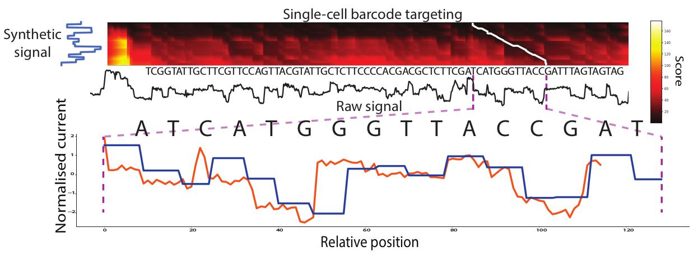

# SquiggleKit

#### A toolkit for accessing and manipulating nanopore signal data

Full documentation: https://psy-fer.github.io/SquiggleKitDocs/

## Overview

| **Tool**      | **Category**  | **Description** |
| ------------- | ------------- | --------------- |
| [Fast5_fetcher](#fast5_fetcher) | `File management`   | Fetches fast5 files given a filtered input list |
| [SquigglePull](#squigglepull)  | `Signal extraction` | Extracts event or raw signal from data files    |
| [SquigglePlot](#squiggleplot)  | `Signal visualisation` | Visualisation tool for signal data       |
| [Segmenter](#segmenter)     | `Signal analysis`   | Finds adapter stall, and homopolymer regions    |
| [MotifSeq](#motifseq)      | `Signal analysis`   | Finds nucleotide sequence motifs in signal, i.e.“Ctrl+F” |


## Requirements

Following a self imposed guideline, most things written to handle nanopore data or bioinformatics in general, will use as little 3rd party libraries as possible, aiming for only core libraries, or have all included files in the package.

In the case of `fast5_fetcher.py` and `batch_tater.py`, only core python libraries are used. So as long as **Python 2.7+** is present, everything should work with no extra steps.

There is one catch. Everything is written primarily for use with **Linux**. Due to **MacOS** running on Unix, so long as the GNU tools are installed (see below), there should be minimal issues running it. **Windows** however may require more massaging.

SquiggleKit tools were not made to be executable to allow for use with varying python environments on various operating systems. To make them executable, add `#!` paths, such as `#!/usr/bin/env python2.7` as the first line of each of the files, then add the SquiggleKit directory to the PATH variable in `~/.bashrc`,  `export PATH="$HOME/path/to/SquiggleKit:$PATH"`

### Install

    git clone https://github.com/Psy-Fer/SquiggleKit.git

for
`fast5_fetcher.py`, `SquigglePull.py`, `segmenter.py`:

- numpy
- matplotlib
- h5py
- sklearn

```
pip install numpy h5py sklearn matplotlib
```

for `MotifSeq.py`:

- all of the above
- mlpy 3.5.0 (don't use pip for this)


#### Installing mlpy:

- Download the [Files](https://sourceforge.net/projects/mlpy/files/)
- Install [Instructions](http://mlpy.sourceforge.net/docs/3.5/install.html)


## Quick start

#### fast5_fetcher

If using MacOS, and NOT using homebrew, install it here:

[**homebrew installation instructions**](https://brew.sh/)

then install gnu-tar with:

    brew install gnu-tar

#### Building the index

How the index is built depends on which file structure you are using. It will work with both tarred and un-tarred file structures. Tarred is preferred. (zip and other archive methods are being investigated)

##### - Raw structure (not preferred)

```bash
for file in $(pwd)/reads/*/*;do echo $file; done >> name.index

gzip name.index
```

##### - Local basecalled structure

```bash
for file in $(pwd)/reads.tar; do echo $file; tar -tf $file; done >> name.index

gzip name.index
```

##### - Parallel basecalled structure

```bash
for file in $(pwd)/fast5/*fast5.tar; do echo $file; tar -tf $file; done >> name.index
```

If you have multiple experiments, then cat them all together and gzip.

```bash
for file in ./*.index; do cat $file; done >> ../all.name.index

gzip all.name.index
```

##### Basic use on a local computer

**using a filtered paf file as input:**

```bash
python fast5_fetcher.py -p my.paf -s sequencing_summary.txt.gz -i name.index.gz -o ./fast5
```


### SquigglePull


**All raw data:**

    python SquigglePull.py -rv -p ~/data/test/reads/1/ -f all > data.tsv

**Positional event data:**

    python SquigglePull.py -ev -p ./test/ -t 50,150 -f pos1 > data.tsv

### SquigglePlot

**Plot individual fast5 file:**

    python SquigglePlot.py -i ~/data/test.fast5

### Segmenter

    python SquigglePlot.py -p ~/data/ --plot_colour -g

**Plot first 2000 data points of each read from signal file and save at 300dpi pdf:**

    python SquigglePlot.py -s signals.tsv.gz --plot_colour teal -n 2000 --dpi 300 --no_show o--save test.pdf --save_path ./test/plots/

### MotifSeq

    python segmenter.py -s signals.tsv.gz -ku -j 100 > signals_stall_segments.tsv

**Nanopore adapter identification:**

    python MotifSeq.py -s signals.tsv.gz --segs signals_stall_segments.tsv -a adapter.model -t 120 -d 120 > signals_adapters.tsv


<p align="left"></p>


## Acknowledgements

I would like to thank the members of my lab, Shaun Carswell, Kirston Barton, Hasindu Gamaarachchi, Kai Martin, Tansel Ersavas, and Martin Smith, from the Genomic Technologies team from the [Garvan Institute](https://www.garvan.org.au/) for their feedback on the development of these tools.

## License

[The MIT License](https://opensource.org/licenses/MIT)
